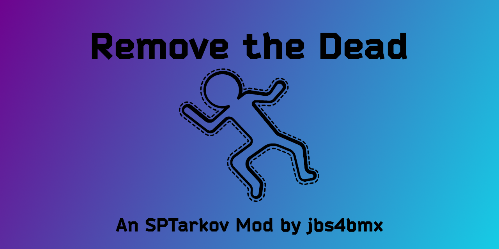

[![Contributors][contributors-shield]][contributors-url]
[![Forks][forks-shield]][forks-url]
[![Stargazers][stars-shield]][stars-url]
[![Issues][issues-shield]][issues-url]
[![MIT License][license-shield]][license-url]

<!-- PROJECT LOGO -->
 

  

  <h3 align="center">Remove The Dead</h3>

  
RTD - Remove the unnecessary scum from the map. 

  

<!-- TABLE OF CONTENTS -->

  
Table of Contents

  <ol>
    <li>
      <a href="#about-the-project">About The Project</a>
      <ul>
        <li><a href="#items-added">Items Added</a></li>
        <li><a href="#mod-variations">Mod Variations</a></li>
        <li><a href="#firearm-support">Firearm Support</a></li>
        <li><a href="#built-with">Built With</a></li>
      </ul>
    </li>
    <li>
      <a href="#getting-started">Getting Started</a>
      <ul>
        <li><a href="#prerequisites">Prerequisites</a></li>
        <li><a href="#installation">Installation</a></li>
      </ul>
    </li>
    <li>
      <a href="#configuration">Configuration</a>
      <ul>
        <li><a href="#mod-faq">Mod FAQ</a></li>
      </ul>
    </li>
    <li><a href="#roadmap">Roadmap</a></li>
    <li><a href="#contributing">Contributing</a></li>
    <li><a href="#license">License</a></li>
    <li><a href="#acknowledgments">Acknowledgments</a></li>
  </ol>

<!-- ABOUT THE PROJECT -->
## About The Project
Type: Client Mod 
Disclaimer: **This mod is provided _as-is_ with _no guarantee_ of support.**

A BepInEx mod for Escape From Tarkov via the modding framework, SPT (aka, SPTarkov, Single Player Tarkov, SPT, etc.). This allows you to set a radius and time interval in which dead bots will be removed from the map. The aim of this mod is to boost performance and increase in-game fps by reducing the number of objects (in this case, dead bots) being processed by the CPU.

Also known as RTD. 
Client mod for Single Player Tarkov (SPT) that removes dead bodies from the map.

(<a href="#readme-top">back to top</a>)

### Built With
| Frameworks/Libraries                                      | Name         | Link                                       |
| :-------------------------------------------------------: | :----------: | :----------------------------------------: |
|               | `C Sharp`    | [C# Documentation][CSharp-url]             |

|                         IDEs                                |      Name       | Link                                      |
| :---------------------------------------------------------: | :-------------: | :---------------------------------------: |
|  | `Visual Studio` | [Visual Studio Website][VisualStudio-url] |

(<a href="#readme-top">back to top</a>)

<!-- GETTING STARTED -->
## Getting Started
This section will explain how to install and use this mod.

### Prerequisites
EFT and SPT are required to use this mod.

### Installation
_For the purpose of these directions, "[SPT]" represents your SPT folder path._

Start by downloading the mod from the [Releases](https://github.com/jbs4bmx/RemoveTheDead/releases) page.

Follow these steps to install and configure the mod:
  1. Extract the contents of the zip file into the root of your [SPT] folder.
     - That's the same location as "SPT.Server.exe" and "SPT.Launcher.exe".
  2. Start SPT.Server.exe and wait until it fully loads.
  3. Start SPT.Launcher.exe.
  4. Now you can launch the game.
  5. To configure or use the mod, press F12 while in game. Mod will be listed among client mods in the BepInEx menu.

(<a href="#readme-top">back to top</a>)

<!-- CONFIGURATION EXAMPLES -->
## Configuration
All configurations are done within the BepInEx F12 menu while in-game.

Customizations:
  - Change time interval between body removals. (time expressed in minutes)
  - Change minimum distance from player that bodies must be at in order to be removed. (distance expressed in meters)
  - Instant removal button in BepInEx menu (F12). Now you can instantly trigger the body removal to occur. Any bodies within your minimum distance from you will not be removed.

(<a href="#readme-top">back to top</a>)

### Mod FAQ
**Q: Where do I report bugs found with the current version of the mod?**  
A: You can report bugs for the current version of this mod on the [RTD Mod Page](https://hub.sp-tarkov.com/files/file/2124-remove-the-dead/).

(<a href="#readme-top">back to top</a>)

<!-- ROADMAP -->
## Roadmap
- [X] Add Changelog
- [ ] Bind instant removal button to desired key on keyboard for quicker removal.

Suggest changes or view/report issues [here](https://github.com/jbs4bmx/RemoveTheDead/issues).

(<a href="#readme-top">back to top</a>)

<!-- CONTRIBUTING -->
## Contributing
Contributions are what make the open source community such an amazing place to learn, inspire, and create. Any contributions you make are **greatly appreciated**.

If you have a suggestion that would make this better, please fork the repo and create a pull request. You can also simply open an issue with the tag "enhancement".
Don't forget to give the project a star! Thanks again!

1. Fork the Project
2. Create your Feature Branch (`git checkout -b feature/AmazingFeature`)
3. Commit your Changes (`git commit -m 'Add some AmazingFeature'`)
4. Push to the Branch (`git push origin feature/AmazingFeature`)
5. Open a Pull Request

You can also buy me a coffee! (This is not required, but I greatly appreciate any support provided.) 

(<a href="#readme-top">back to top</a>)

<!-- LICENSE -->
## License
Distributed under the MIT License. See `LICENSE.txt` for more information.

(<a href="#readme-top">back to top</a>)

<!-- ACKNOWLEDGMENTS -->
## Acknowledgments
Contributors: 
DJLang, Helldiver, Devraccoon, CactusPie
  - Some code is borrowed from ["Body Disposal Service Maid (B.D.S.M.)" by DJLang](https://github.com/KillerDJLang/BDSM), which is an updated version of ["Body Disposal Service Maid (B.D.S.M.)" by Helldiver](https://github.com/Volomon/BDSM).
    - [SPT Link for B.D.S.M.](https://hub.sp-tarkov.com/files/file/1620-b-d-s-m-body-disposal-service-maid/?highlight=Body%20Disposal)

  - Some code is borrowed from [RAM Cleaner Fix by Devraccoon](https://github.com/CactusPie/SPT-RamCleanerInterval), which is an updated version of [RAM Cleaner Fix by CactusPie](https://github.com/CactusPie/SPT-RamCleanerInterval).
    - [SPT LINK for RAM Cleaner Fix](https://hub.sp-tarkov.com/files/file/1827-ram-cleaner-fix/?highlight=RAM%20Cleaner)

(<a href="#readme-top">back to top</a>)

<!-- Repository Metrics -->
[contributors-shield]: https://img.shields.io/github/contributors/jbs4bmx/RemoveTheDead.svg?style=for-the-badge
[contributors-url]: https://github.com/jbs4bmx/RemoveTheDead/graphs/contributors
[forks-shield]: https://img.shields.io/github/forks/jbs4bmx/RemoveTheDead.svg?style=for-the-badge
[forks-url]: https://github.com/jbs4bmx/RemoveTheDead/network/members
[stars-shield]: https://img.shields.io/github/stars/jbs4bmx/RemoveTheDead.svg?style=for-the-badge
[stars-url]: https://github.com/jbs4bmx/RemoveTheDead/stargazers
[issues-shield]: https://img.shields.io/github/issues/jbs4bmx/RemoveTheDead.svg?style=for-the-badge
[issues-url]: https://github.com/jbs4bmx/RemoveTheDead/issues
[license-shield]: https://img.shields.io/github/license/jbs4bmx/RemoveTheDead.svg?style=for-the-badge
[license-url]: https://github.com/jbs4bmx/RemoveTheDead/blob/master/LICENSE.txt

<!-- Framwork/Library URLs -->
[CSharp-url]: https://learn.microsoft.com/en-us/dotnet/csharp/
[VisualStudio-url]: https://visualstudio.microsoft.com/
